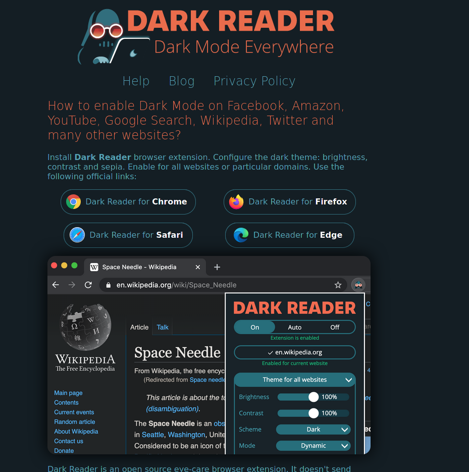
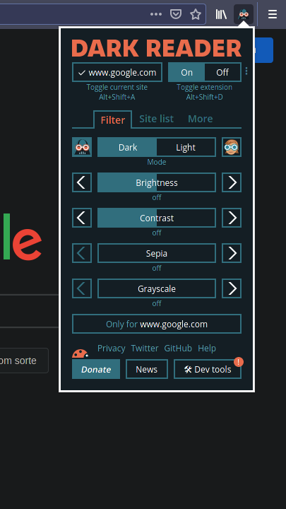
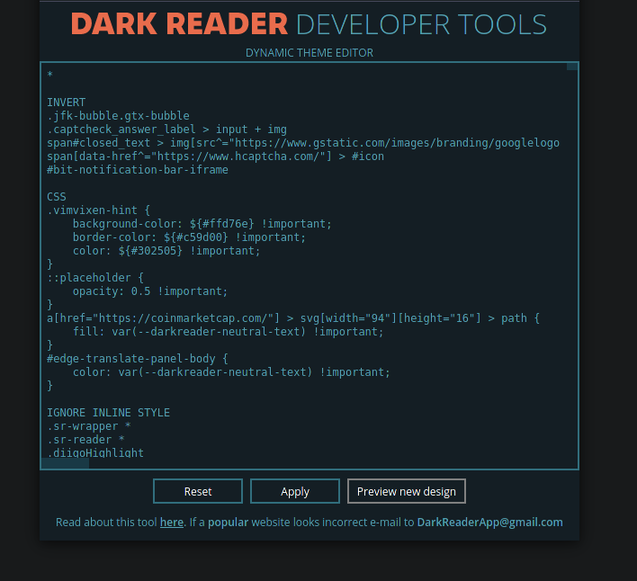
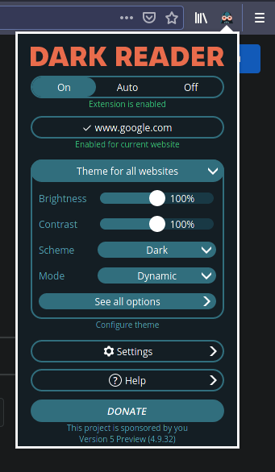
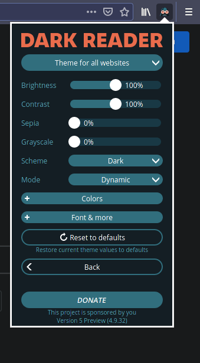
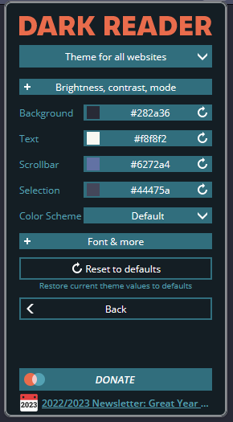
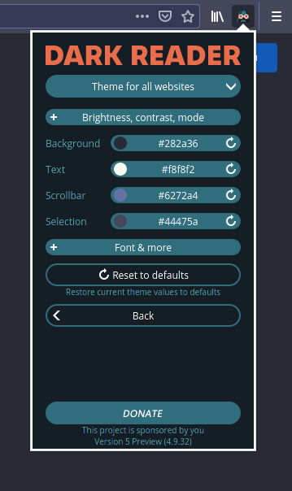

### [Dark Reader](https://darkreader.org/)

### Dracula Theme for all websites

#### Install 

1. Install Dark Reader in your browser;\

\
\
2. Switch to new Design;\
2.1. First Click in "Dev tools"\

2.2. Click in "Preview new design"\

\
\

3. Insert Dracula Colors\
3.1. Go to "See all options"\
\
3.2. Go to "Colors"\
\
3.3. Change Colors\

Set:

Background: #282a36
 
Text: #f8f8f2
 
Scrollbar --> custom: #6272a4
 
Selection --> custom: #44475a
 
 

Result\
