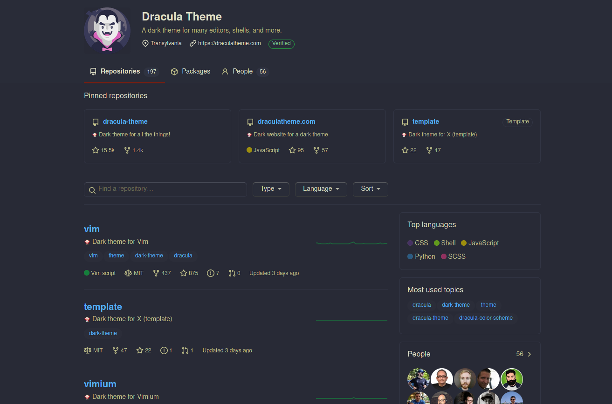
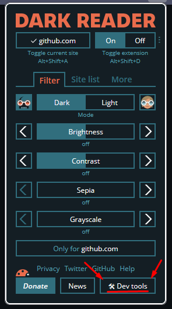
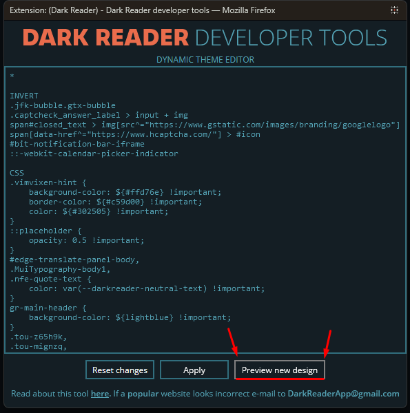
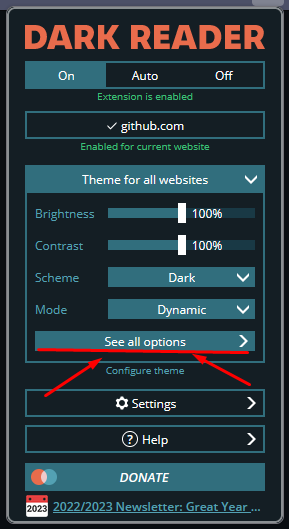
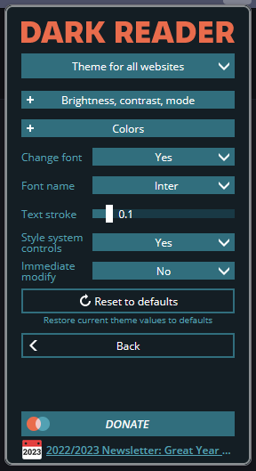

# Dracula for [Dark Reader](https://darkreader.org/)

> A dark theme for [Dark Reader](https://darkreader.org/).

## Install

After installing a Dark Reader to your web browser of choice, follow the steps bellow to add Dracula theme to your `Dark Reader`:

1. Click on "Dev Tools"

2. Enable "Preview new design"
   

3. Click "See all options"

4. Click on "Colors"

4. set the following values:

|Field|Value|
|-----|------|
|Background | `#282a36` |
|Text | `#f8f8f2` |
|Scrollbar --> custom |  `#6272a4` |
|Selection --> custom | `#44475a` |

### The final result should be something like this:

## Optional
### Custom Font
Dark Reader also allows you to set custom fonts that will used on the websites you visit.

To apply this, get back to "See all options", and then "Fonts & more".

Switch the "Change font" setting to `Yes`, then you will be able to change your fonts under "Font name".

The drop down has a few default choices, but you can manually type your font of choice if you want.

## Team

This theme is maintained by the following person(s) and a bunch of awesome contributors.

|  | 
| ------------------------------------------------------------------------ | -------------------------------------------------------------------------------------------------------- |
| [Dpbm](https://github.com/Dpbm)                                          | [JakubZ0](https://github.com/JakubZ0)                                                                |

## License

[MIT License](./LICENSE)
