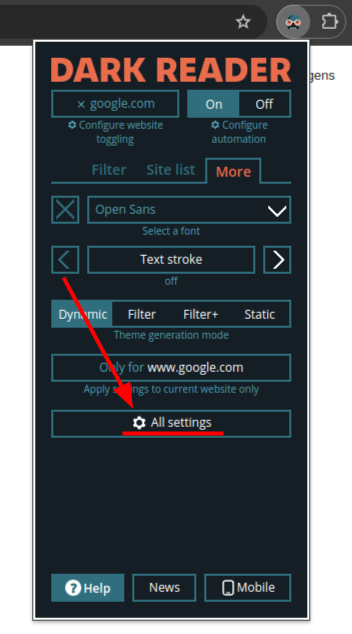

# Dracula for [Dark Reader](https://darkreader.org/)

> A dark theme for [Dark Reader](https://darkreader.org/).

## Install

After installing Dark Reader to your web browser of choice, follow the steps bellow to add the Dracula theme:

1. Click on `More`

2. Click on `All Settings`
   

3. Click on `Advanced`

4. Click on `Dev Tools`

5. Click on `Advanced` again

6. Change to new design

7. Reopen the extension

8. Click on `See all Options`

9. Click on `Colors`

10. Change the color scheme to `Dracula`

## Optional
### Custom Font
Dark Reader also allows you to set custom fonts that will be used on the websites you visit.

To change this:

1. reopen the extension

2. Click on `See all Options`

3. Click on `Font & More`

4. Then change the `Change font` selector from `No` to `Yes`

5. Now, you can use the `Font Name` selector to insert which font do you want to use

## Team

This theme is maintained by the following person(s) and a bunch of awesome contributors.

|  |  |  |
| ------------------------------------------------------------------------ | --------------------------------------------------------------------------------- | --------------------------------------------------------------------------------- |
| [Dpbm](https://github.com/Dpbm)                                          | [JakubZ0](https://github.com/JakubZ0)                                             | [CBroz1](https://github.com/CBroz1) |

## License

[MIT License](./LICENSE)
